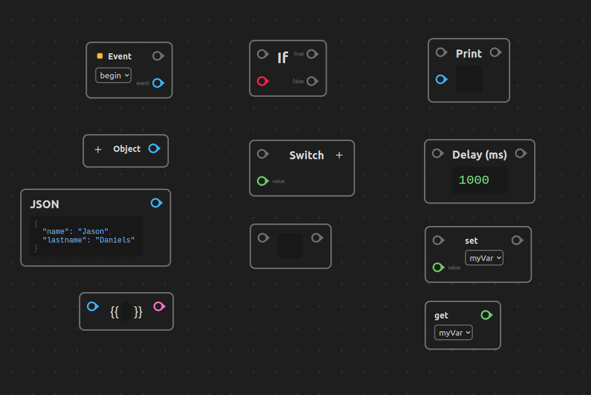
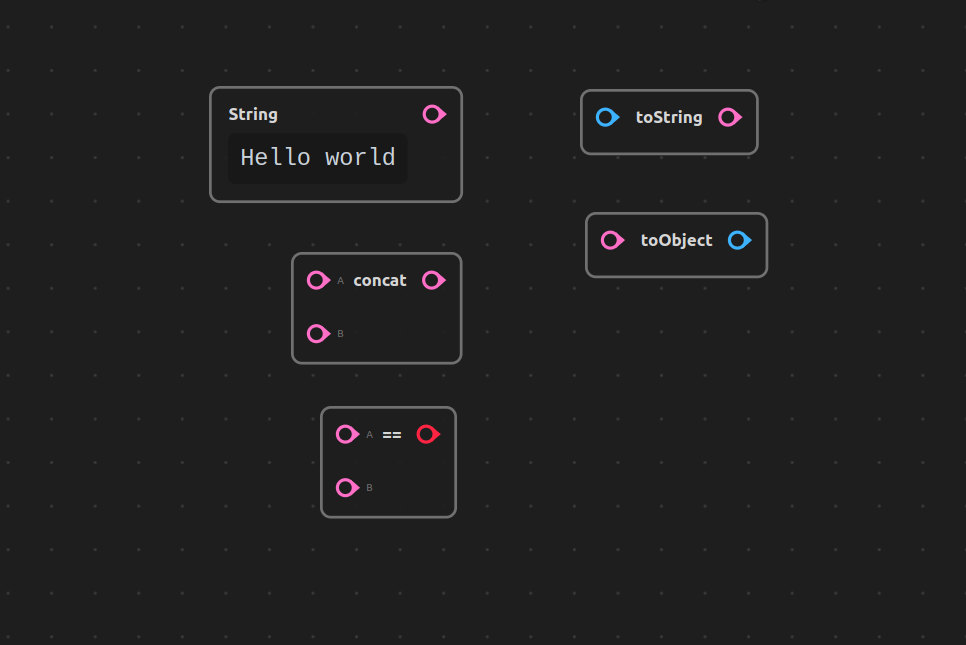
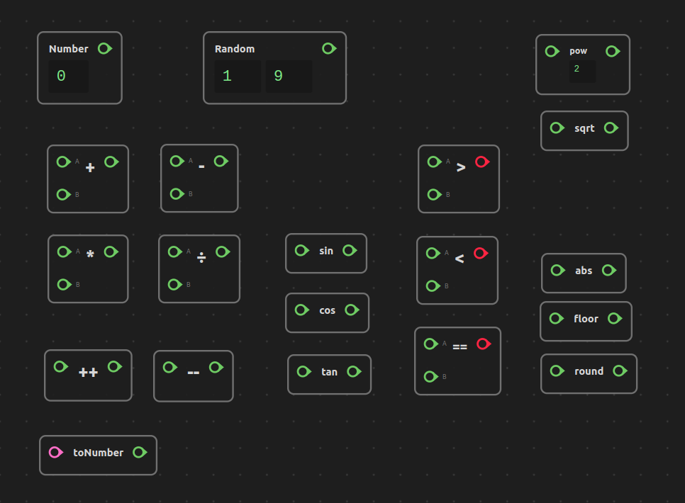
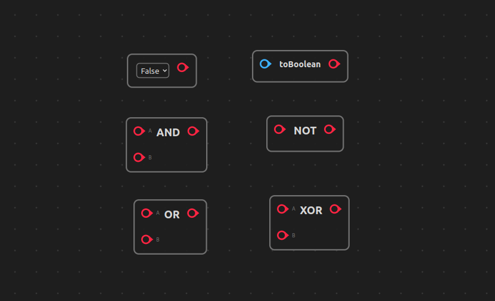
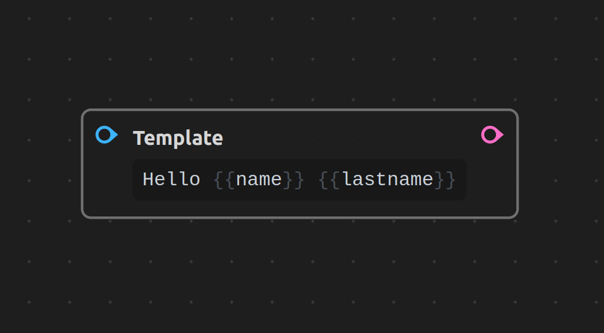
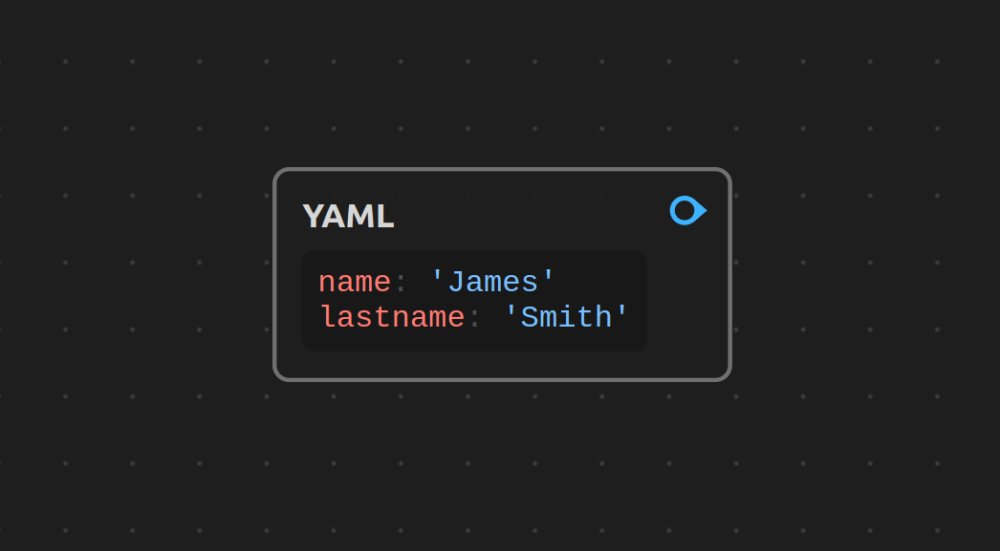
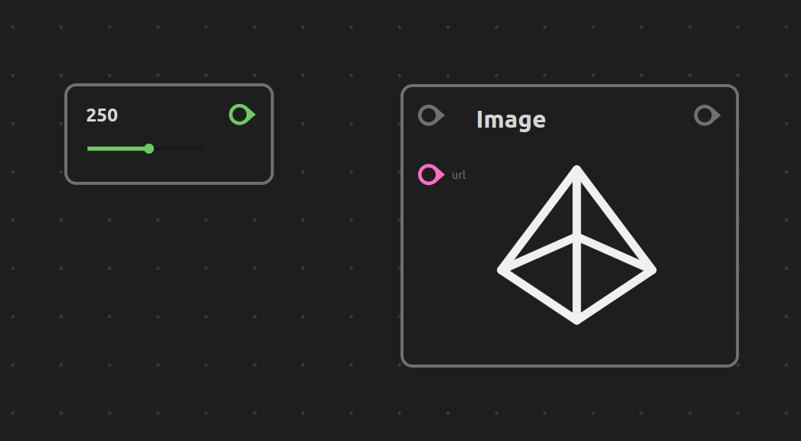
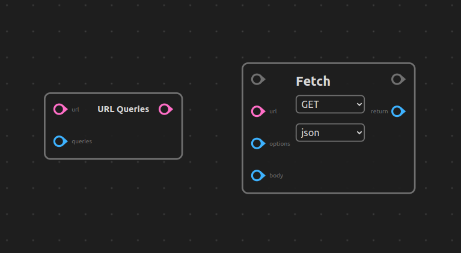
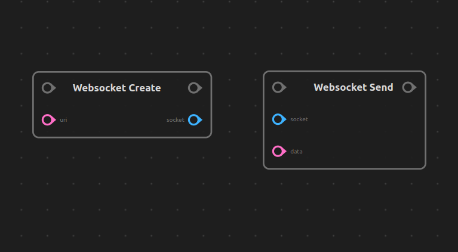

# `@oxenode/std`

## Build the std plugins

```sh
npm run mono run install

npm run mono run build
```


<br/>

## Plugin CDNs

You **do not** need to include these plugins CDN yourself, as they are fetched by default by the Oxenode Web application.

> DISCLAIMER: These plugins are not complete, there might be missing nodes, or even bindings that could be better, and serve as a proof of concept of how a plugin system can be used to allow third party custom nodes.

<br/>

# Plugins


<br/>

# Base

Includes Events, Branching, Variables, Delays and more.

<p align="center">
	
</p>

### CDN

```
https://cdn.jsdelivr.net/gh/oxenode/std/plugins/oxenode-std-base
```

<br/>

# String

Adds string literals, String compare, and other string related utilities

<p align="center">
	
</p>

### CDN

```
https://cdn.jsdelivr.net/gh/oxenode/std/plugins/oxenode-std-string
```

<br/>

# Math

Adds math operations and number literals.

<p align="center">
	
</p>

### CDN

```
https://cdn.jsdelivr.net/gh/oxenode/std/plugins/oxenode-std-math
```

<br/>

# Boolean

Adds boolean constants and logic operations

<p align="center">
	
</p>


### CDN

```
https://cdn.jsdelivr.net/gh/oxenode/std/plugins/oxenode-std-boolean
```

<br/>

# Template

Adds Handlebars language support for string formatting. Since handlebars is a heavy library, this node is in it's own separate plugin

<p align="center">
	
</p>


### CDN

```
https://cdn.jsdelivr.net/gh/oxenode/std/plugins/oxenode-std-template
```

<br/>

# Yaml

Adds YAML parsing, similar to the JSON node in [oxenode-std-base](#base)

<p align="center">
	
</p>

### CDN

```
https://cdn.jsdelivr.net/gh/oxenode/std/plugins/oxenode-std-yaml
```


<br/>

# Widgets

Adds visual/interactive widgets.

> TODO: This plugin could have time based graphs, pie charts, etc 

<p align="center">
	
</p>


### CDN

```
https://cdn.jsdelivr.net/gh/oxenode/std/plugins/oxenode-std-widgets
```

<br/>

# HTTP

Adds HTTP related bindings (fetch API)

<p align="center">
	
</p>


### CDN

```
https://cdn.jsdelivr.net/gh/oxenode/std/plugins/oxenode-std-http
```


<br/>


# WebSockets

Binds the WebSocket api (fetch API)

<p align="center">
	
</p>

### CDN

```
https://cdn.jsdelivr.net/gh/oxenode/std/plugins/oxenode-std-ws
```

